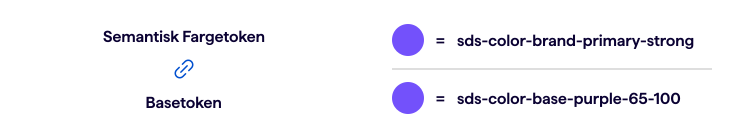
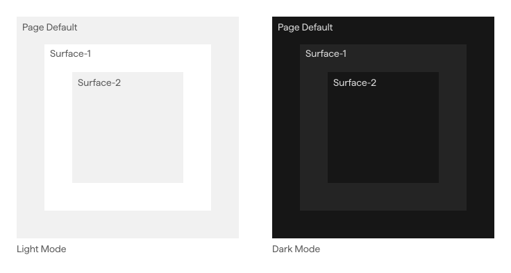
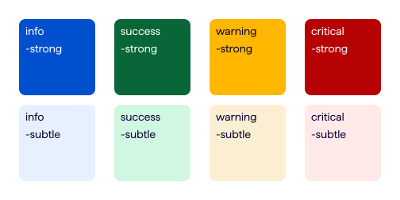
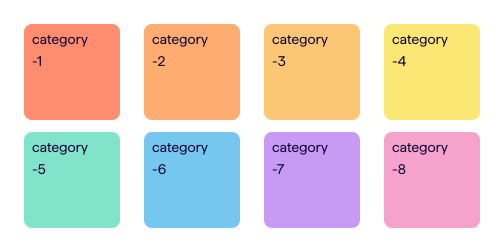

import { Picture } from "astro:assets";
import ImageCard from "../../components/card/ImageCard.astro";
import { MdxComponents } from "../../layouts/_components/mdx/MdxComponents";
export const components = {
  ...MdxComponents,
  img: (props) => (
    <ImageCard>
      <Picture formats={["avif", "webp"]} widths={[240, 540]} {...props} />
    </ImageCard>
  ),
};

import { GuidePanel } from "@sikt/sds-message";
import { Hero } from "../../components";
import TagList from "../../components/tag/TagList.astro";

<Hero
  breadcrumbs={[
    { title: "Designsystem", href: "/" },
    { title: "Produktutvikling" },
  ]}
  heading={frontmatter.pageTitle}
>
  I Sikt er det mange produkter og team med forskjellige behov og målgrupper.
  For å gjøre det mulig å fremstå helhetlige og samkjørte på tvers av flater
  spiller fargebruk en stor rolle.
</Hero>

<GuidePanel variant="warning">
  Denne siden er under utvikling og kan endres uten forvarsel. Vi ønsker gjerne
  at dere tester mønsteret og gir oss tilbakemeldinger på hvordan dere tilpasser
  det i deres produkt. Sist oppdatert 16 Oktober 2025.
</GuidePanel>

## Designtokens for farger

SDS har valgt å ta i bruk designtokens for sitt fargesystem. Designtokens er en metode for navngiving av designvariabler, i tilfellet farge betyr dette kombinasjonen av et navn som folk kan kjenne igjen og en sekssifret HEX-kode som spesifiserer hvilken farge navnet tilsvarer.

SDS benytter to typer fargetokens for å lage et system som er skalerbart og enkelt å vedlikeholde; semantiske fargetokens, og et basetoken.

### Semantiske fargetokens

At noe er semantisk betyr at navnet følger funksjon og bruk.

Vi har farger som benyttes for ting brukeren kan klikke på som heter f.eks -color-interaction-primary-strong og vi har farger som benyttes for å varsle brukeren om at en oppgave er fullført, som -color-support-success-strong.

Semantisk navngiving I SDS består av opptil fire ledd som blir gradvis mer spesifikke:

<TagList
  tags={[
    { tag: "interaction", name: "Element/funksjon" },
    { tag: "primary", name: "Theme" },
    { tag: "strong", name: "Variant" },
    { tag: "hover", name: "Tilstand" },
  ]}
/>

Det er ikke alle farger som har themes eller tilstander.

### Basetokens

Dette er den grunnleggende fargepaletten i SDS. Det består av utvalgte nyanser for følgende fargegrupper Purple, Blue, Green, Yellow, Red og Neutral.

Navnestruktur for basetokens er:

<TagList
  tags={[
    { tag: "base", name: "Base" },
    { tag: "purple", name: "Farge" },
    { tag: "90", name: "Lightness" },
    { tag: "100", name: "Opacity" },
  ]}
/>

Dette nivået av fargetokens linkes til fra semantiske tokens, og brukes ikke direkte i ferdige komponenter eller designfiler.

## Sidekomposisjon og struktur

SDS legger opp til bruk av forskjellige bakgrunnsfarger for å strukturere sider og gruppere informasjon og funksjonalitet som hører sammen.

Systemet har en fargetoken for sidens bakgrunn (sds-color-layout-page-default) og to tokens for innhold som kort, komponenter, dialoger, paneler osv. (sds-color-layout-surface-1 og sds-color-layout-surface-2) som ligger på siden. -surface-2 legges oppå -surface-1 og vice-versa, og man starter alltid med -surface-1 oppå -page-default.

## Interaktive komponenter

SDS har tre nivåer av interaktive komponenter;

-strong, -subtle og -transparent

Hver av disse har tokens for :hover og :active

Det er også to themes for de lavere nivåene i interaksjonspaletten;

-primary- og -neutral-

Disse er nivåmessig likestilte, og vi anbefaler at -sds-color-interaction-neutral benyttes for grensesnitt med høy informasjonstetthet og mange interaktive elementer.

## Statusfarger

SDS har fire semantiske farger som bruker for å indikere status på oppgaver eller gi brukeren tilbakemelding. Disse er Info, Success, Warning og Critical.

Hver statusfarge har en -strong variant og en -subtle variant.

SDS sin anbefaling er å ikke benytte disse fargene utenfor komponenter som leveres fra SDS. De skal ikke brukes for å kategorisere innhold i tabeller eller for å differensiere innhold på en side. For slik bruk anbefaler vi at du benytter kategorifargene.

## Kategorifarger

SDS har en palett av farger som er laget for differensiering av innhold i kontekster der fargen ikke har en spesifikk betydning. Disse fargene er laget for å fungere godt sammen, og passer best i kontekster der man benytter flere farger fra paletten.

Eksempler på bruksområder for denne paletten er; tagging av innhold i lister og tabeller, Informasjonsvisualisering med behov for differensiering av variabler, differensiering av oppgaver eller varsler.
