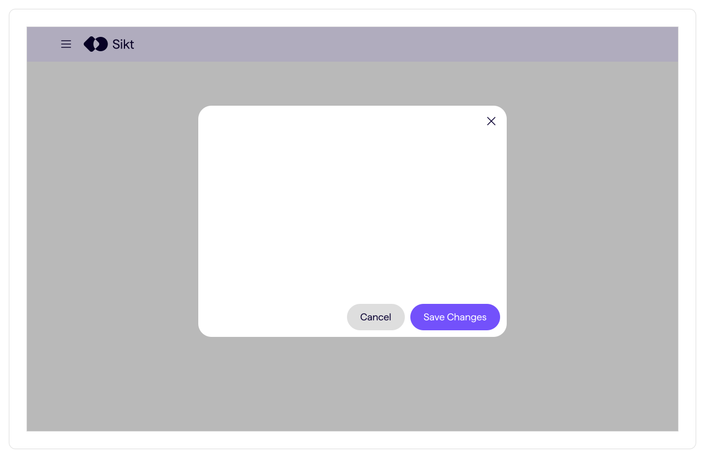
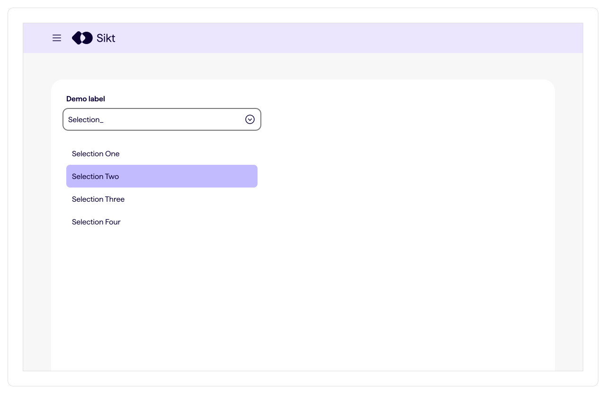
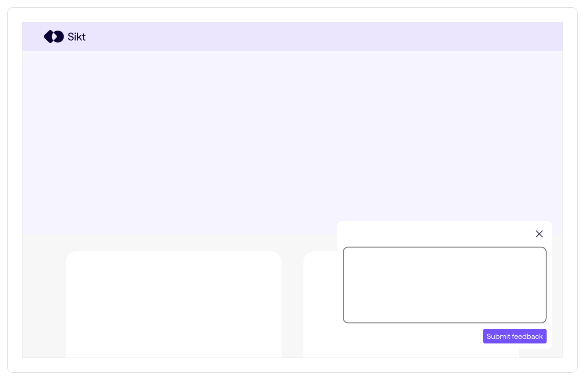
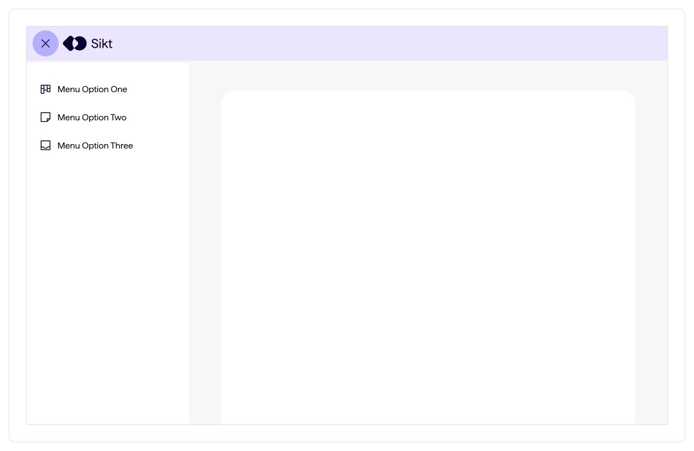

import { Picture } from "astro:assets";
import ImageCard from "../../../components/card/ImageCard.astro";
import { MdxComponents } from "../../../layouts/_components/mdx/MdxComponents";
export const components = {
  ...MdxComponents,
  img: (props) => (
    <ImageCard>
      <Picture formats={["avif", "webp"]} widths={[240, 540]} {...props} />
    </ImageCard>
  ),
};

import { Hero } from "../../../components";
import { GuidePanel } from "@sikt/sds-message";
import { Link } from "@sikt/sds-core";
export const storybookUrl = import.meta.env.PUBLIC_STORYBOOK_URL;

<Hero
  breadcrumbs={[
    { title: "Designsystem", href: "/" },
    { title: "Produktutvikling" },
    { title: "Mønstre", href: "/produktutvikling/monstre" },
  ]}
  heading={frontmatter.pageTitle}
/>

<GuidePanel variant="warning">
  Dette mønstret er under utvikling og kan endres uten forvarsel. Vi ønsker
  gjerne at dere tester mønsteret og gir oss tilbakemeldinger på hvordan dere
  tilpasser det i deres produkt. Sist oppdatert 29 September 2025.
</GuidePanel>

En dialog er et panel i grensesnittet som har en spesifikk funksjon som en bruker kan interagere med. Dialoger kan være såkalt modale eller ikke-modale.

En modal dialog setter brukeren i en spesifikk kontekst, og tvinger brukeren til å fokusere på denne oppgaven. Brukeren må enten fullføre eller avbryte oppgaven før de kan gjøre en annen oppgave. Modale dialoger legger seg nesten alltid oppå resten av løsningen.

Ikke-modale dialoger kan åpnes og gi tilgang på oppgaver/funksjoner uten å hindre brukeren fra å interagere med andre ting.

## Retningslinjer og veiledning

Bruk av dialoger er per definisjon veldig kontekstavhengig. Modale dialoger er veldig effektive for å varsle brukeren om feil, eller forhindre at feil oppstår. Samtidig tar de kontrollen, som kan være frustrerende spesielt for erfarne brukere. Det er lurt å ha en klar strategi rundt bruk av modale dialoger, og teste hvordan de påvirker brukeropplevelsen.

### Modale dialoger passer bra til

- Varsling og utbedring av kritiske feil
- Redusering av risiko for kritiske feil i komplekse oppgaver, for eksempel bekreftelse av ikke-reversible valg
- Utfylling av viktig informasjon som må fylles ut for å komme videre
- Bryte opp komplekse oppgaver i flere, separate oppgaver

### Modale dialoger passer mindre bra til

- Oppgaver med under-oppgaver, du bør aldri ha en modal dialog inne i en modal dialog
- Oppgaver som er så omfattende at de burde gis en egen side eller arbeidsflyt, for eksempel skjemaer med flere steg

### Ikke-modale dialoger passer bra til

- Tilleggsfunksjonalitet til en hovedoppgave, som for eksempel filtrering av en listevisning, eller styling av tekst i en rik teksteditor
- Alternative visninger av innhold, som for eksempel oppsummering av et skjema eller en oppgave
- Lokale menyer på store skjermstørrelser
- Tilleggsinformasjon som kan hjelpe noen brukere, for eksempel en steg-for-steg veileder for et skjema, eller en chatbot

### Ikke-modale dialoger passer mindre bra til

- Oppgaver som krever at brukeren gjør et valg før oppgaven kan fullføres

## Dialog-komponenter

Vi har en [dialog-komponent](/produktutvikling/komponenter/dialog) som lar deg bygge modale og ikke-modale dialoger med stor fleksibilitet.

## Forskjellige typer dialoger med eksempler

### Modal dialog som visuelt blokkerer innhold

Denne typen har alltid lukkeknapp og minst én action-knapp. Action-knappen vil lukke dialogen og ta deg tilbake til grensesnittet eller til en ny side.

- Varsling om kritisk feil
- Bekrefte innsending av skjema som ikke kan endres etter innsending

  <Link href={`${storybookUrl}?path=/story/components-dialog--default`}>
    Eksempel på modal dialog som visuelt blokkerer innhold i Storybook
  </Link>

{/* TODO: [Link til demo av skjema-bekreftelse]() */}

### Modal dialog som ikke visuelt blokkerer innhold

Denne typen har ofte lukkeknapp eller toggle, men lukkes også om du klikker utenfor dialogen. Å lukke dialogen ved å klikke utenfor har samme effekt som lukkeknappen, oppgaven avbrytes uten at noen valg lagres.

- Lokal navigasjon som legger seg oppå sideinnhold
- Dropdown-lister for select, comboboks etc.

{/* TODO: [Link til demo av lokal navigasjon]() */}

### Ikke-modal dialog som legger seg oppå innhold

Har lukkeknapp og ofte én eller flere action-knapper. Du kan fortsatt bruke resten av grensesnittet utenfor dialogen. Action-knapper vil vanligvis implementere valg fra dialogen, men dialogen lukkes ikke.

- Chatbot-vindu
- Feedback-skjema

  <Link href={`${storybookUrl}?path=/story/components-dialog--non-modal`}>
    Eksempel på ikke-modal dialog i Storybook
  </Link>

{/* TODO: [Link til demo av feedbackskjema]() */}

### Ikke-modal dialog som legger seg inne i sideinnholdet, i stedet for oppå

Denne typen har lukkeknapp eller toggle for å vise/skjule dialogen. Den har ofte flere typer knapper.

- Toolbars
- Filtreringspaneler for lister eller tabeller
- Oppsummering av skjemaer

{/* TODO: [Link til demo av filterpanel]() */}
