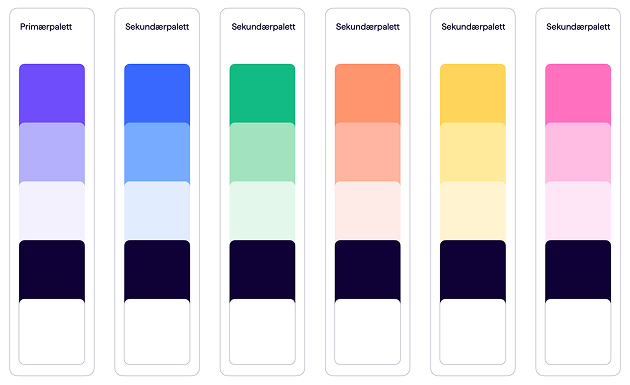
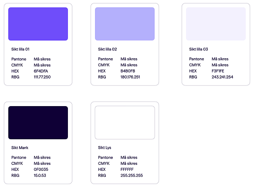
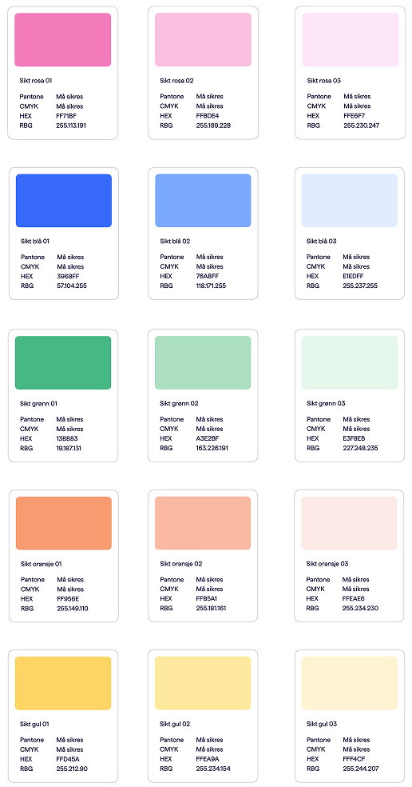
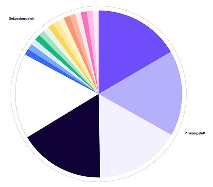

import { Picture } from "astro:assets";
import ImageCard from "../../components/card/ImageCard.astro";
import { MdxComponents } from "../../layouts/_components/mdx/MdxComponents";
export const components = {
  ...MdxComponents,
  img: (props) => (
    <ImageCard>
      <Picture formats={["avif", "webp"]} widths={[240, 540]} {...props} />
    </ImageCard>
  ),
};

import { Hero } from "../../components";

<Hero
  breadcrumbs={[{ title: "Designsystem", href: "/" }, { title: "Visuell identitet" }]}
  heading={frontmatter.pageTitle}
>
  Denne siden gir et overordnet blikk på hvordan Sikt bruker farger i sin
  visuelle identitet, og er spesielt aktuell for de som jobber med
  produksjon av trykksaker, kommunikasjon og innhold til sosiale medier.

I digital produktutvikling bruker vi et [tokenbasert fargesystem](/produktutvikling/fargesystem).

</Hero>

## Fargesystem

Sikt sine farger består av en primærpalett i lilla, samt flere
sekundærfarger. Det vi produserer skal i hovedsak basere seg på
hovedfargene, men man kan bruke støttefarger som “krydder”, og for å
utvide antallet farger der det trengs, for eksempel ved datavisualisering.

## Hovedfarger

Hovedfargene våre baserer seg i hovedsak rundt en lilla fargepalett. Den
lilla fargen er et av våre sterkeste virkemidler for å skape identietet og
gjenkjennelse, og hjelper oss med å skille oss ut fra konkurrenter og
andre organisasjoner.

## Støttefarger

I tillegg til de lilla hovedfargene har Sikt en palett av støttefarger man
kan bruke. Typiske bruksområder for dette kan være trykksaker,
illustrasjoner, innhold til sosiale medier og datavisualisering/grafikk.
Husk at lilla er fargen som skal assosieres med Sikt.

Vær forsiktig med bruk av farger som lett kan tolkes. For eksempel kan det
å bruke oransje og grønn i en datavisualisering gi en semantisk antydning
om at et resultat er bra eller dårlig.

## Fargehierarki

Når vi lager innhold til Sikt som overordnet avsender skal hovedfargene
alltid brukes i størst grad. Samtidig har vi mulighet til å trekke inn små
drypp fra støttefargene våre for å skape mer variasjon og fleksibilitet.

Illustrasjoner er eksempler på materiale som benytter seg av primærfarger
sammen med støttefarger.

## Produkter og tjenester med egne farger

Sikts merkevarestrategi sier at produkter og tjenester som utvikles, skal
ha Sikt som avsender. Dermed skal de ha Sikt-branding, og benytte seg av
våre lilla hovedfarger.

Noen produkter i Sikt har så sterke egne merkevarer at dette ikke er
aktuelt. Vi arbeider nå med å lage et utvidet fargesystem som gir disse
produktene anledning til å lage fargetemaer basert på deres egne
merkevarefarger. På den måten kan vi få disse produktene til å passe inn i
Sikt-familien.

Hvis du er nysgjerrig på å ta i bruk Sikts designsystem og mener at det
gjelder ditt team, vennligst ta kontakt med designsystem-teamet.
