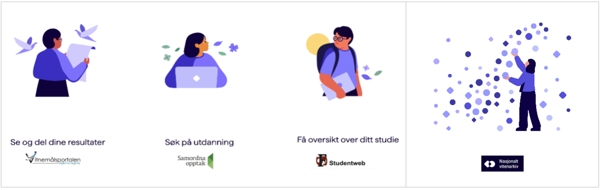
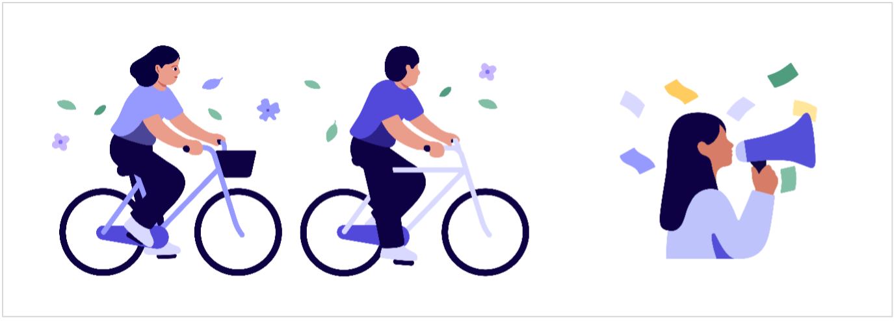
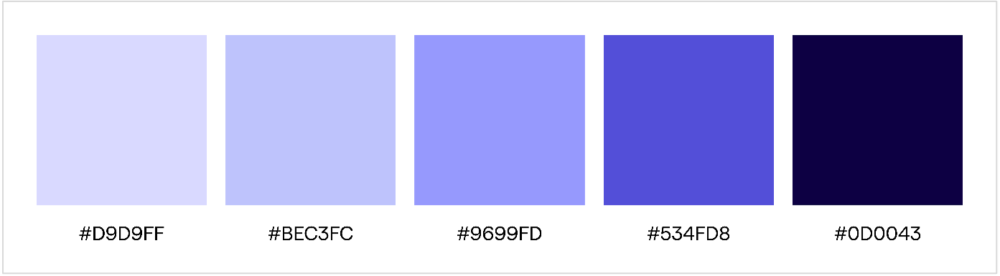

import { Picture } from "astro:assets";
import ImageCard from "../../components/card/ImageCard.astro";
import { MdxComponents } from "../../layouts/_components/mdx/MdxComponents";

export const components = {
  ...MdxComponents,
  img: (props) => (
    <ImageCard>
      <Picture formats={["avif", "webp"]} widths={[240, 540]} {...props} />
    </ImageCard>
  ),
};

import { Hero } from "../../components";

<Hero
  breadcrumbs={[
    { title: "Designsystem", href: "/" },
    { title: "Visuell identitet" },
  ]}
  heading={frontmatter.pageTitle}
>
  Sikt har utviklet en egen illustrasjonsstil for å skape en unik og konsistent
  visuell identitet som skal styrke merkevaren til Sikt. Vi jobber stadig med å
  utvikle dette uttrykket.
</Hero>

## Om Sikts illustrasjonsstil

Sikts illustrasjonsstil baserer seg på designstilen «flat illustration». Dette er en visuell stil som kjennetegnes av enkelhet og todimensjonalitet.

Stilen unngår bevisst elementer som skaper en illusjon av dybde eller tredimensjonal realisme, selv om Sikt har gjort noen grep (som enkle skygger) for å skape liv og dynamikk.

Stilen gir et moderne, rent og profesjonelt uttrykk som er lett å skalere til ulike formater, laster raskt digitalt, og kommuniserer tydelig på tvers av kulturer. Stilen er godt egnet for nettsider, apper, infografikk og presentasjoner.

Vi samarbeider med en illustratør i utvikling av stil og illustrasjonselementer.

## Hovedkjennetegn

Sikts illustrasjonsstil kjennetegnes av:

- **Rene fargeflater**: Kun solide, flate farger uten gradienter eller teksturer
- **Ingen konturer**: Objekter og former defineres utelukkende av fargeflater som møtes, uten omrisslinjer eller streker
- **Todimensjonalt uttrykk**
- **Enkelhet**: Enkle former og vektlegging av det essensielle
- **Fargekontraster**: Fargevalg er avgjørende for at elementer skal skille seg fra hverandre og bakgrunnen

## Prinsipper og formspråk

Vi har utarbeidet noen prinsipper som til sammen skal danne uttrykket i vår illustrasjonsstil. Formspråket skal være minimalistisk og abstrahert, men skal likevel ha et varmt og naturlig formspråk.

Prinsipper:

- Naturlig kroppsholdning
- Objekter kan illustreres med mer liv sett fra vinkel og med skygge i stedet for helt flatt
- Naturlige farger i ansikt
- For motiver der man er tett på skal motivet bære en personlighet ved å ha f.eks. øyne eller “ansikt”
- For motiver der ansiktet ikke er i fokus kan detaljer i fjes droppes

## Tilgang til illustrasjonene

I [illustrasjonsbiblioteket i Figma](https://www.figma.com/design/tcrj6hB65MilDuLsml3uBJ/Illustrasjonsbibliotek?m=auto) finner du godkjente illustrasjoner som kan brukes av alle i Sikt.

Illustrasjonene er laget av illustratør Oscar Grønner i samarbeid med Sikt. Illustrasjonene er opphavsrettslig beskyttet og skal kun brukes av Sikt og i sammenheng med Sikt sin merkevare. Dersom andre ønsker å benytte illustrasjonene, må dette avklares og godkjennes av Sikt.

Har du behov for andre illustrasjoner enn de som finnes i biblioteket, kan du sende en forespørsel til [kommunikasjon@sikt.no](mailto:kommunikasjon@sikt.no).

## Egne illustrasjoner for spesifikke tjenester

Det er mye som er likt på tvers av produktene i Sikt, som farger, stil og komponenter. Likevel er det også et behov for å gi brukeren noen knagger som bare hører til den enkelte tjenesten. Derfor er det tilfeller hvor vi har utviklet egne illustrasjoner som er skreddersydd en tjeneste. Målet er at disse illustrasjonene vil hjelpe brukeren til å assosiere, huske og navigere bedre. I eksemplene under kan du se illustrasjoner som tilhører Min kompetanse og Nasjonalt vitenarkiv. Disse illustrasjonene skal ikke brukes i andre kontekster enn det som omhandler de spesifikke produktene.

## Støtteelementer som skaper liv

For å gi illustrasjonene liv og gjøre dem mindre stive kan vi bruke små “støtteelementer”. På eksempelet under kan du se at det er brukt støtteelementer som blader og blomster.

## Farger

### Hovedfargepalett

Vi bruker en lilla fargepalett som fundament i Sikts illustrasjoner. Denne fargepaletten skal være tydelig til stede i alle illustrasjoner, med mindre det er veldig enkle illustrasjoner av objekter som f.eks. mynter eller trær.

### Fargepalett for hud

I tillegg til hovedfargepaletten har vi en egen fargepalett for hudfarger som brukes på alle mennesker. Sikts illustrasjoner skal kommunisere med hele bredden av den norske befolkningen. Vi må være bevisste på å vise mangfold og bredde i hvordan vi fremstiller mennesker. Vi har derfor utviklet en fargepalett hvor vi kan velge mellom ulike hudtoner. Fargepaletten på bildet under viser hovedfargene for hud på Sikts illustrasjoner.

#### Hovedfarger for hud

Sikts illustrasjoner inneholder også et par andre hudfarger enn de fire hovedfargene. Disse hudfargene er spesielt brukt på mennesker på avstand uten detaljer i ansiktet. Dermed er det ikke utviklet tilhørende farger for øyebryn, nese og munn. På bildet under kan du se eksempler på disse hudfargene, som det er mulig å ta i bruk som hudfarge på illustrasjoner av mennesker uten detaljer i ansiktet.

### Tilleggsfarger for illustrasjoner

Vi har definert en fargepalett for tilleggsfarger som du kan bruke på Sikts illustrasjoner for å variere det visuelle uttrykket. Denne fargepaletten baserer seg på [Sikts støttefarger](/visuell-identitet/fargepalett/#støttefarger). Den gule og grønne skalaen er utvidet og justert etter aksentfargene som illustratøren har brukt i illustrasjonene våre.

### Retningslinjer for bruk av tilleggsfargene

For at vi skal beholde Sikts merkevare er det nødvendig med noen retningslinjer for hvordan vi kan bruke disse tilleggsfargene.

#### 1. Tilleggsfargene kan kun brukes på én ting om gangen

I en illustrasjon kan tilleggsfargene kun brukes på én enkelt ting om gangen. Dersom du for eksempel ønsker å bruke en tilleggsfarge på en illustrasjon av et menneske med en megafon, kan du endre fargen på genseren eller megafonen, men ikke begge deler. Grunnen til dette er at vi ønsker å beholde det grafiske uttrykket som vi kjenner igjen i de lilla Sikt-fargene.

#### 2. Ikke bland ulike fargegrupper i samme illustrasjon

Vi skiller mellom **fargegrupper** innenfor tilleggsfargene (grønn, gul, rosa, blå). I en illustrasjon kan du bruke tilleggsfarger fra kun én fargegruppe. Dersom du for eksempel skal endre fargen på et par hodetelefoner kan du bruke både den lyse og mørke grønnfargen for å skille mellom de ulike delene av objektet. Det samme gjelder overdeler som ofte har en lys hovedfarge og en mørkere farge for å visualisere skygger. Du kan imidlertid ikke bruke både grønn og blå på hodetelefonene. Dette betyr at du kan velge ulike nyanser av en fargegruppe, men ikke blande ulike fargegrupper i samme illustrasjon.

#### 3. Tilleggsfargene kan kun brukes på objekter og overdeler

Tilleggsfargene skal i all hovedsak kun brukes på gjenstander, tilbehør og dekorative elementer, samt klær på overkroppen til mennesker. Tilleggsfargene skal ikke brukes på underdeler (bukse, shorts og skjørt) eller som hår-, hud- eller øyefarge på mennesker.

#### Unntak: når det er brukt støtteelementer

Det finnes sjelden regler uten unntak, og i dette tilfellet vil det være unntak fra retningslinjene når det er brukt støtteelementer i illustrasjonen. I eksemplene under er det brukt blader og blomster for å skape liv i illustrasjonen. I dette tilfellet er fargen grønn allerede brukt på bladene. Her kan du likevel bruke en ny tilleggsfarge på en annen ting, som eksempelvis en blomst eller et klesplagg.

