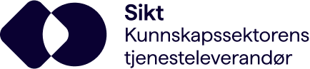
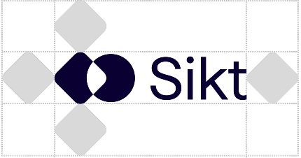
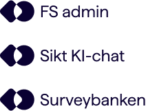

import { Picture } from "astro:assets";
import ImageCard from "../../components/card/ImageCard.astro";
import { MdxComponents } from "../../layouts/_components/mdx/MdxComponents";
export const components = {
  ...MdxComponents,
  img: (props) => (
    <ImageCard>
      <Picture formats={["avif", "webp"]} widths={[240, 540]} {...props} />
    </ImageCard>
  ),
};

import { Button, ButtonGroup } from "@sikt/sds-button";
import { Hero } from "../../components";

<Hero
  breadcrumbs={[{ title: "Designsystem", href: "/" }, { title: "Visuell identitet" }]}
  heading={frontmatter.pageTitle}
>
  Sikt som virksomhet kan ikke styre hvordan omverden oppfatter oss – merkevaren
  formes i samspillet mellom hva vi om virksomhet sier og gjør, og hvordan
  mennesker opplever og deler dette. Derfor er det viktig å være konsekvent,
  oppriktig og helhetlig. På den måten øker sjansene for at publikums oppfatning
  samsvarer med det vi som virksomhet ønsker å kommunisere.

  <ButtonGroup>
    <Button variant="strong" disabled>Last ned logopakke</Button>
  </ButtonGroup>
</Hero>

## Primærlogo

Primærlogoen er den varianten av logoen som blir vist på de fleste flatene
i Sikt. Her vises navnet vårt sammen med ikonet.

Primærlogoen vår skal kun brukes i fargene Sikt Mørk og Sikt Lys uavhengig
av hvilken bakgrunnsfarge den plasseres mot.

For å sikre tydelighet og leselighet er det definert en minimumstørrelse
for primærlogoen vår både for print og digitale flater.

Minimumsstørrelse på skjerm: 60 px bredde  
Minimumsstørrelse på trykk: 20 mm bredde

## Sekundærlogo

Av og til trengervi en logo med en dypere forklaring av merkevaren vår.
Derfor viser sekundærlogoen hele merkevarenavnet vårt fordelt på tre
linjer.

I denne versjonen skiller vi ut tykkelsen av fonten på navnet Sikt for å
skape balanse mot logoikonet samtidig som vi kommuniserer overordnet at
Sikt er Kunnskapssektorens tjenesteleverandør.

Vi har også varianter på engelsk, nynorsk, finsk og samisk For å sikre
tydelighet og leselighet er det definert en minimumstørrelse for
sekundærlogoen vår både for print og digitale flater.

Minimumsstørrelse på skjerm: 90 px bredde  
Minimumsstørrelse på trykk: 35 mm bredde

## Ikon

Logoikonet vårt er laget for å fungere både i bevegelse og statisk, og vil
i samtlige varianter tydeliggjøre mulighetsrommet.

Typisk bruk av logoikonet for seg selv vil være i et profilbilde på
Facebook, Instagram eller nettside. Med andre ord steder der
merkevarenavnet vårt (Sikt) vil være synlig i sammenheng med ikonet.

For å sikre tydelighet og leselighet er det definert en minimumstørrelse
for logoikonet vår både for print og digitale flater.

Minimumsstørrelse på skjerm: 25 px bredde  
Minimumsstørrelse på trykk: 8 mm bredde

## Beskyttelsesområde

Det er definert et beskyttelsesområde rundt logoene for å sikre god
synlighet. Beskyttelsesområdet er definert ut fra høyden på firkanten i
logoen. Dette området skaleres proporsjonalt med logoen. Ingen elementer
skal plasseres nærmere logoikonet enn det som er definert.

## Tjenester og produkter

Sikts merkevarestrategi statuerer at alle nye produkter og tjenester som
Sikt utvikler skal bruke Sikt-ikonet sammen med tjenestenavnet.

Eksisterende produkter med egen visuell profil også skal ta i bruk Sikts
visuelle identitet og logo, men endringen kan skje stegvis og over tid.
Endringer i eksisterende profil gjøres på en slik at måte at vi ivaretar
tilliten brukerne har til produktet. Endringer skjer for eksempel ved
oppgraderinger, modernisering og nødvendige omskrivinger av frontend på
produktene.

Tjenester vi leverer og utvikler i samarbeid med andre, hvor Sikt ikke er
eneste leverandør, må vurderes individuelt.

Minimumsstørrelse på trykk: 6 mm høyde  
Minimumsstørrelse på skjerm: Defineres av komponent i komponentbiblioteket

