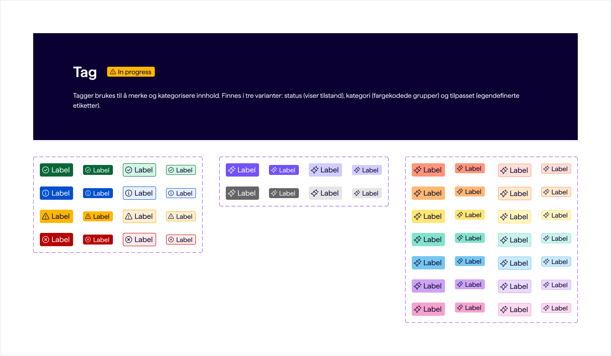
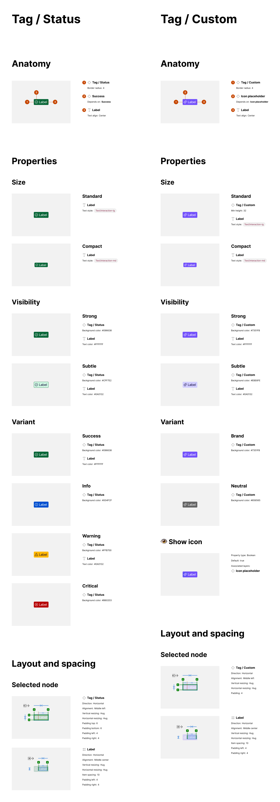

# Tag family — Spec

**Figma:** [SDS Komponenter — Tag](https://www.figma.com/design/0aelUwbn2Ivir3T2JfhdOo/SDS-Komponenter?node-id=30410-1006&m=dev)
**Component folders:**

- `packages/design-system/src/Tag/` — flexible `<Tag>` (brand, neutral, category-*)
- `packages/design-system/src/TagStatus/` — semantic `<TagStatus>` (success, info, warning, critical)

**Shared implementation** — lives in `packages/design-system/src/internals/tag-base/` (neutral location, imported by both `Tag` and `TagStatus`):

- `TagIcon.tsx` — internal React icon slot. Exposed on `Tag` as `Tag.Icon`; `TagStatus` uses it internally to render its locked semantic icon.

Layout, sizing, and typography rules are duplicated in `tag.css` and `tag-status.css` — CSS `@scope` takes a single root selector, so each component owns its own scoped copy of the shared base. Variant-specific styling in each file uses `--tag-base-*` custom properties over the shared base.

**Replaces:** `@sikt/sds-tag`
**Last synced:** 2026-09-02

> **Note.** This is a shared spec covering **two components**. They share layout, sizing, visibility semantics, tokens, and accessibility, but differ in variant palette and icon behaviour. Sections that apply to only one component say so in the "Applies to" column or a sub-heading.

## Overview

Small inline labels used to categorise, tag, or annotate content. Two components with distinct roles:

- **`TagStatus`** — semantic status. Renders a locked icon per status; the consumer cannot swap it. Reach for this when the tag communicates a state the user should recognise (success, info, warning, critical).
- **`Tag`** — flexible labelling. Consumer-driven `variant` covers brand/neutral tone and a categorical colour palette (7 hues). Optional consumer-supplied icon. Reach for this for arbitrary tagging, categorisation, or brand-coloured annotations.

Both are purely presentational — no hover, focus, dismiss, or interactive behaviour is expressed in Figma.

## Shared variant axes

These axes apply to **both** components.

| Axis       | Values            | Default  | Figma label mapping                    | Notes                                                                                                                                                                                                                                  |
| ---------- | ----------------- | -------- | -------------------------------------- | -------------------------------------------------------------------------------------------------------------------------------------------------------------------------------------------------------------------------------------- |
| visibility | strong, subtle    | subtle   | Strong → strong, Subtle → subtle       | `strong` = filled background. `subtle` = tinted background. Adds a 1px border in the matching strong hue for `TagStatus` and `Tag` category-* variants; **no border** for `Tag` brand and neutral variants (Figma is source of truth). |
| size       | standard, compact | standard | Standard → standard, Compact → compact | `standard` = 32px min-height, `compact` hugs content (~24px). Typography and icon size scale together. Values reuse the shared `SizeDensity` type exported from `packages/design-system/types`.                                        |

## Component-specific variant axes

### `TagStatus`

| Axis    | Values                           | Default             | Figma label mapping                                                    | Notes                                                      |
| ------- | -------------------------------- | ------------------- | ---------------------------------------------------------------------- | ---------------------------------------------------------- |
| variant | success, info, warning, critical | _(none — required)_ | Success → success, Info → info, Warning → warning, Critical → critical | Each value binds to its own semantic colour + locked icon. |

### `Tag`

Single unified `variant` prop — brand/neutral and category-\* are all "pick a colour", not independent axes. Type composed from the shared `Variant` and `Category` types via template literal.

| Axis    | Values                                                                                             | Default | Figma label mapping                                                                                        | Notes                                                                                                                                                                                                                                       |
| ------- | -------------------------------------------------------------------------------------------------- | ------- | ---------------------------------------------------------------------------------------------------------- | ------------------------------------------------------------------------------------------------------------------------------------------------------------------------------------------------------------------------------------------- |
| variant | brand, neutral, category-1, category-2, category-3, category-4, category-5, category-6, category-7 | neutral | Brand → brand, Neutral → neutral, Category 1..7 → category-1..7. See open question re: Figma "Category 8". | Type: `Extract<Variant, "brand" \| "neutral"> \| \`category-${Exclude<Category, "8">}\``. Seven category hues match `color/component/category/{strong,subtle}/{1..7}`. Category 8 exists in the token catalog but is not yet used in Figma. |

## Interaction states

Both components are **presentational only**. No hover, focus, active, disabled, dismiss, or loading states are expressed in Figma.

If a `TagStatus` conveys live status (e.g. server status, form submission result), the consumer should apply `role="status"` at the call site — see Accessibility. The component does not do this automatically because most usages are static annotations, not live regions.

## Slots

| Slot     | Component  | Content      | Constraint                                                                                                                                                                                                                     |
| -------- | ---------- | ------------ | ------------------------------------------------------------------------------------------------------------------------------------------------------------------------------------------------------------------------------ |
| children | both       | Label text   | Required. Does not wrap (`white-space: nowrap`). Ellipsis truncation only activates when the tag has a bounded width (consumer sets `max-width` or a parent grid track constrains it); otherwise the tag grows to fit content. |
| icon     | `Tag` only | Icon element | Optional. `TagStatus` does **not** expose this slot — the icon is locked per `variant`.                                                                                                                                        |

## Internal composition

### `TagStatus` — locked semantic icon

Every `TagStatus` renders an internal icon determined by `variant`. The consumer cannot override or hide it. Per the Figma component description: _"Ikonet kan ikke byttes ut … Hvis du trenger en tag hvor du kan bytte ut ikonet, bruk category eller custom."_

| variant  | Internal icon (visual in Figma) |
| -------- | ------------------------------- |
| success  | Check in circle                 |
| info     | Info (i) in circle              |
| warning  | Warning triangle                |
| critical | X in circle                     |

> Icon _shapes_ above are described from the Figma reference screenshot; the exact glyph asset from the icon library is [[implement-component-spec]]'s call. Existing `@sikt/sds-tag` used `SuccessIcon`, `InfoIcon`, `AlertIcon`, `FailedIcon` — visually consistent with the shapes above.

### `Tag` — no internal composition

`Tag` renders only what the consumer supplies (label + optional icon). No internal parts.

## Icons used

### Slot icons (consumer supplies) — `Tag` only

| Slot | Example icon in Figma                                                       | Notes                                                                  |
| ---- | --------------------------------------------------------------------------- | ---------------------------------------------------------------------- |
| icon | `artificial-intelligence` (Custom frame), placeholder Icon (Category frame) | Consumer supplies any icon. Optional. Sized to match the tag's `size`. |

### Internal icons (component renders) — `TagStatus` only

| Variant  | Icon (visual in Figma) | Where it appears | Notes                             |
| -------- | ---------------------- | ---------------- | --------------------------------- |
| success  | check in circle        | Leading position | Colour follows text colour token. |
| info     | info (i) in circle     | Leading position | Colour follows text colour token. |
| warning  | warning triangle       | Leading position | Colour follows text colour token. |
| critical | X in circle            | Leading position | Colour follows text colour token. |

## Props / API (proposal)

Consumer-facing surface. Framework-neutral slot types. Implementation-level concerns (HTMLAttributes passthrough, ref forwarding, className, className merging) are decided by [[implement-component-spec]].

Types reused from `packages/design-system/types`: `Variant`, `Category`, `SizeDensity`.

### `TagStatus`

```ts
export interface TagStatusProps {
  /** Semantic status the tag communicates. Determines both colour and internal icon. */
  variant: Extract<Variant, "success" | "info" | "warning" | "critical">;
  /** Visual emphasis. `strong` = filled background, `subtle` = tinted background with border. */
  visibility?: "strong" | "subtle";
  /** Size (shared SizeDensity). `standard` = 32px min-height, `compact` = smaller (~24px). */
  size?: SizeDensity;
  /** Label text. */
  children: Content;
}
```

### `Tag`

```ts
type TagVariant =
  Extract<Variant, "brand" | "neutral"> | `category-${Exclude<Category, "8">}`;

export interface TagProps {
  /** Colour variant. Brand/neutral for general tagging; `category-1..7` for a categorical hue palette. */
  variant?: TagVariant;
  /** Visual emphasis. `strong` = filled background, `subtle` = tinted background with border (category variants only). */
  visibility?: "strong" | "subtle";
  /** Size (shared SizeDensity). `standard` = 32px min-height, `compact` = smaller (~24px). */
  size?: SizeDensity;
  /** Label text. */
  children: Content;
  /** Optional icon rendered before the label. */
  icon?: Icon;
}
```

## Accessibility

Applies to both components unless noted.

- **Semantic element:** `<span>`. Neither component is interactive; both render as inline flow content.
- **Keyboard:** N/A — not focusable, not interactive.
- **Screen reader / ARIA:**
  - Default: no `role` — the tag reads as inline text.
  - `TagStatus`: when the tag is being used to communicate a **live** status change (e.g. after form submission, background job result), the consumer should add `role="status"` and, if appropriate, `aria-live="polite"` at the call site. The component does not do this automatically because the majority of usages are static labels, not live regions.
  - The internal icon in `TagStatus` is decorative — the variant's colour and adjacent label carry the meaning. Icon should be marked `aria-hidden="true"` in the DOM.
- **Focus:** N/A — not focusable.
- **WAI-ARIA pattern:** N/A — no interactive widget pattern applies. Purely presentational.

## Design tokens

Recorded as Figma binds them. Whether these tokens exist in the SD3 CSS catalog is [[implement-component-spec]]'s call.

### Figma-bound tokens — shared layout, typography

| Figma token                 | Current value              | CSS property                 | Applies to                           |
| --------------------------- | -------------------------- | ---------------------------- | ------------------------------------ |
| `space/component/100`       | 4px                        | padding (all sides)          | Both components, both sizes          |
| `space/component/100`       | 4px                        | `gap` between icon and label | Both components with icon            |
| `layout/radius/02`          | 4px                        | border-radius                | Both components, all variants        |
| `spacing/border/weight/xs`  | 1px                        | border-width                 | Both components, `visibility=subtle` |
| `typography/interaction-lg` | Haffer Regular 18px / 18px | font                         | Both components, `size=default`      |
| `typography/interaction-md` | Haffer Regular 16px / 16px | font                         | Both components, `size=compact`      |
| `typography/weight/regular` | 400                        | font-weight                  | Both components                      |

### Figma-bound tokens — `TagStatus` colours

| Figma token                            | Current value | CSS property     | Applies to                                                                                                                    |
| -------------------------------------- | ------------- | ---------------- | ----------------------------------------------------------------------------------------------------------------------------- |
| `color/support/success/strong`         | #096638       | background-color | variant=success, visibility=strong                                                                                            |
| `color/support/success/subtle`         | #cff7e2       | background-color | variant=success, visibility=subtle                                                                                            |
| `color/support/success/strong`         | #096638       | border-color     | variant=success, visibility=subtle                                                                                            |
| `color/support/info/strong`            | #004fcf       | background-color | variant=info, visibility=strong                                                                                               |
| `color/support/info/subtle`            | #e6f0ff       | background-color | variant=info, visibility=subtle                                                                                               |
| `color/support/info/strong`            | #004fcf       | border-color     | variant=info, visibility=subtle                                                                                               |
| `color/support/warning/strong`         | #ffb700       | background-color | variant=warning, visibility=strong                                                                                            |
| `color/support/warning/subtle`         | #fceed2       | background-color | variant=warning, visibility=subtle                                                                                            |
| `color/support/warning/strong`         | #ffb700       | border-color     | variant=warning, visibility=subtle                                                                                            |
| `color/support/critical/strong`        | #b60203       | background-color | variant=critical, visibility=strong                                                                                           |
| `color/support/critical/subtle`        | #ffeae9       | background-color | variant=critical, visibility=subtle                                                                                           |
| `color/border/critical`                | #b60203       | border-color     | variant=critical, visibility=subtle                                                                                           |
| `color/text/on-strong`                 | #ffffff       | color            | visibility=strong for success, info, critical — label + icon. **Not applied to warning** (see next row).                      |
| `color/component/category/subtle/text` | #0a0132       | color            | visibility=subtle (all variants) — label; **also visibility=strong for warning** (dark text on yellow; white fails contrast). |
| `color/icon/on-strong`                 | #ffffff       | color            | visibility=strong — icon fill (same warning caveat as text).                                                                  |
| `color/component/category/subtle/icon` | #0a0132       | color            | visibility=subtle — icon fill; also warning strong.                                                                           |

### Figma-bound tokens — `Tag` colours

| Figma token                            | Current value               | CSS property     | Applies to                                           |
| -------------------------------------- | --------------------------- | ---------------- | ---------------------------------------------------- |
| `color/brand/primary-strong`           | #7351fb                     | background-color | variant=brand, visibility=strong                     |
| `color/interaction/subtle/default`     | #d1cdff                     | background-color | variant=brand, visibility=subtle (no border)         |
| `color/neutral/600`                    | #656565                     | background-color | variant=neutral, visibility=strong                   |
| `color/interaction/neutral/default`    | #e5e5e5                     | background-color | variant=neutral, visibility=subtle (no border)       |
| `color/component/category/strong/1`    | #ff957a                     | background-color | variant=category-1, visibility=strong                |
| `color/component/category/subtle/1`    | #ffe0d9                     | background-color | variant=category-1, visibility=subtle                |
| `color/component/category/strong/2`    | #fdb972                     | background-color | variant=category-2, visibility=strong                |
| `color/component/category/subtle/2`    | #ffe9c8                     | background-color | variant=category-2, visibility=subtle                |
| `color/component/category/strong/3`    | #fbe774                     | background-color | variant=category-3, visibility=strong                |
| `color/component/category/subtle/3`    | #fef5c0                     | background-color | variant=category-3, visibility=subtle                |
| `color/component/category/strong/4`    | #82e3cb                     | background-color | variant=category-4, visibility=strong                |
| `color/component/category/subtle/4`    | #c9f3ea                     | background-color | variant=category-4, visibility=subtle                |
| `color/component/category/strong/5`    | #75c7f0                     | background-color | variant=category-5, visibility=strong                |
| `color/component/category/subtle/5`    | #c9e9fa                     | background-color | variant=category-5, visibility=subtle                |
| `color/component/category/strong/6`    | #cca3f5                     | background-color | variant=category-6, visibility=strong                |
| `color/component/category/subtle/6`    | #ebd9fe                     | background-color | variant=category-6, visibility=subtle                |
| `color/component/category/strong/7`    | #f5a3cc                     | background-color | variant=category-7, visibility=strong                |
| `color/component/category/subtle/7`    | #fcd8ed                     | background-color | variant=category-7, visibility=subtle                |
| `color/text/on-strong`                 | #ffffff                     | color            | brand, neutral: visibility=strong                    |
| `color/component/category/strong/text` | #0a0132                     | color            | category-*: visibility=strong (text + icon)          |
| `color/component/category/subtle/text` | #0a0132                     | color            | brand, neutral, category-*: visibility=subtle (text) |
| `color/component/category/strong/icon` | #0a0132                     | color            | category-*: visibility=strong (icon fill)            |
| `color/component/category/subtle/icon` | #0a0132                     | color            | visibility=subtle (icon fill)                        |
| Border colour for category subtle      | matching `.../strong/*` hue | border-color     | category-*: visibility=subtle                        |

### Hardcoded values

Kept as literal values in code. Implementation should annotate each with a short comment explaining they are not yet tokenised in Figma.

| Raw value                                         | CSS property      | Applies to                                                                                                                                                                                                   |
| ------------------------------------------------- | ----------------- | ------------------------------------------------------------------------------------------------------------------------------------------------------------------------------------------------------------ |
| 20px                                              | icon width/height | `size=default` — icon box size (not a bound token in Figma)                                                                                                                                                  |
| 16px                                              | icon width/height | `size=compact` — icon box size (not a bound token in Figma)                                                                                                                                                  |
| `text-ellipsis whitespace-nowrap overflow-hidden` | label overflow    | Label truncation baked into Figma layout, no token binding                                                                                                                                                   |
| `#656565`                                         | background-color  | `Tag variant=neutral, visibility=strong` — Figma binds `color/neutral/600` but no matching `--sd3-*` token exists in `@sikt/sd3-design-tokens`. Approved for hardcoding pending a `color-neutral-600` token. |

### Token name mappings (Figma → SD3 catalog)

The following Figma tokens use different names in the SD3 CSS catalog. The **values are identical** — the implementation uses the SD3 token names:

| Figma token                 | Value | SD3 token                                                                                                           | Notes                                                                                                                                                                                   |
| --------------------------- | ----- | ------------------------------------------------------------------------------------------------------------------- | --------------------------------------------------------------------------------------------------------------------------------------------------------------------------------------- |
| `layout/radius/02`          | 4px   | `--sd3-space-border-radius-100`                                                                                     | Same value; naming differs.                                                                                                                                                             |
| `spacing/border/weight/xs`  | 1px   | `--sd3-space-border-weight-025`                                                                                     | Same value; naming differs.                                                                                                                                                             |
| `typography/interaction-lg` | 18/18 | `--sd3-typography-size-text-interaction-lg` (1.125rem) + `--sd3-typography-line-height-text-interaction-lg` (1.222) | Figma's 100% line-height is not literally applied — CSS `line-height: 1` clips descenders (g/q/p). SD3 token line-height also brings the standard-size tag to Figma's ~32px min-height. |
| `typography/interaction-md` | 16/16 | `--sd3-typography-size-text-interaction-md` (1rem) + `--sd3-typography-line-height-text-interaction-md` (1.25)      | Same rationale as `interaction-lg`.                                                                                                                                                     |

## Reference screenshots

Captured from Figma into `packages/design-system/src/Tag/spec/screenshots/`. [[review-component-spec]] compares these against Storybook.

-  — full page: description heading + all three variant matrices side by side (TagStatus 4×4, Tag/Custom 2×4, Tag/Category 7×4). Captured from Figma node `30410:1006`.
-  — Figma spec sheet for `Tag / Status` and `Tag / Custom`: anatomy, properties (size, visibility, variant), and layout/spacing annotations.

## Open questions & gaps

1. **`visiblity` misspelling in `TagCategory` frame variant names.** Reported to designer for cleanup in the Figma source. Not consumer-visible.

## Documentation text (verbatim from Figma)

From the Tag page description heading:

> Tagger brukes til å merke og kategorisere innhold. Finnes i tre varianter: status (viser tilstand), kategori (fargekodede grupper) og tilpasset (egendefinerte etiketter).

The page also carries an "In progress" `TagStatus` (variant=warning) next to the "Tag" title, indicating the component itself is still being finalised in Figma.
